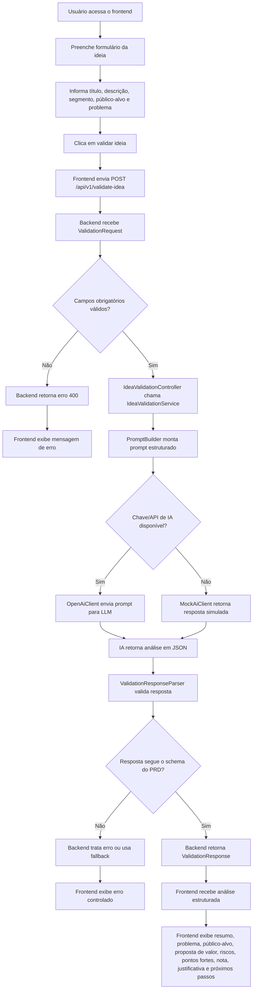
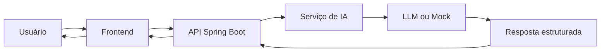

# Fluxograma — IdeaCheck AI

Este documento apresenta o fluxo principal de funcionamento do **IdeaCheck AI**.

O objetivo do fluxograma é demonstrar como o usuário interage com a aplicação, como os dados são enviados para o backend, como a camada de IA ou mock processa a ideia e como a análise estruturada é retornada ao frontend.

---

## 1. Fluxo principal da aplicação

---

## 2. Fluxo resumido

---

## 3. Observações

- O frontend é responsável por capturar os dados da ideia e exibir a análise.
- O backend é responsável por validar a entrada, acionar o serviço de IA e retornar resposta padronizada.
- A camada de IA pode usar uma integração real com LLM ou um mock para permitir execução sem chave de API.
- O schema da resposta deve seguir a especificação definida no `docs/PRD.md`.
- O modo mock garante que o MVP continue demonstrável mesmo sem integração real disponível no momento da apresentação.

---

## 4. Relação com os requisitos

Este fluxograma contribui para evidenciar:

- funcionamento geral da aplicação;
- papel funcional da IA no produto;
- integração entre frontend, backend e serviço de IA;
- existência de fallback/mock;
- organização do fluxo de dados;
- alinhamento com o PRD e com a matriz de rastreabilidade.