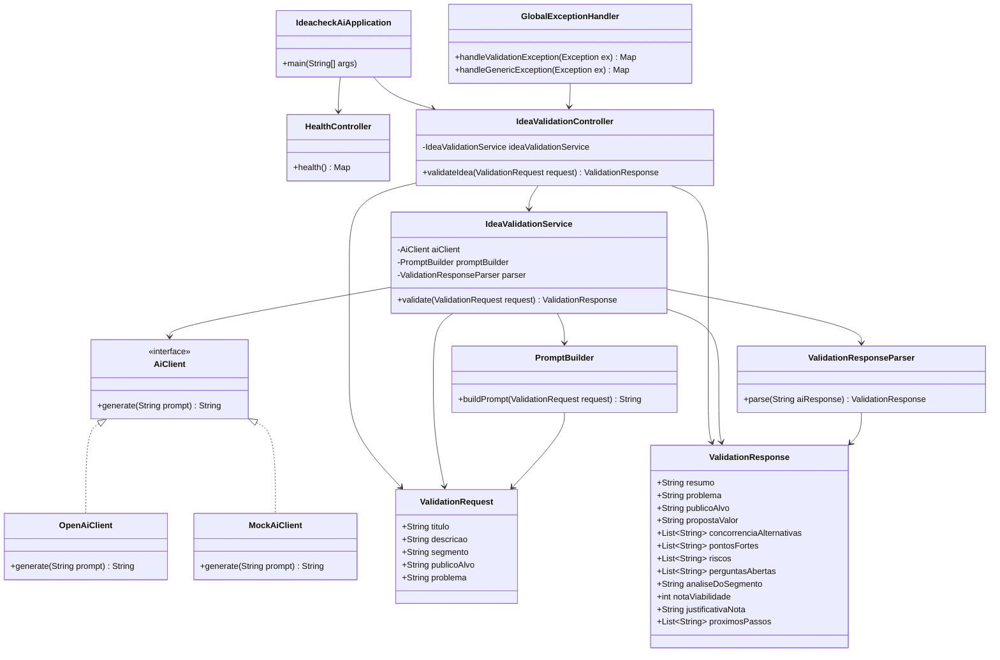

# UML — IdeaCheck AI

Este documento apresenta o diagrama UML inicial do projeto **IdeaCheck AI**.

O diagrama representa a arquitetura planejada do MVP, incluindo controller, DTOs, serviço de IA, cliente de IA, mock e parser da resposta.

---

## 1. Diagrama de classes



---

## 2. Observações sobre o diagrama

Este diagrama representa a arquitetura inicial planejada para o MVP.

As classes podem ser ajustadas durante a implementação, desde que o contrato definido no `docs/PRD.md` seja preservado.

---

## 3. Responsabilidade das principais classes

### `IdeacheckAiApplication`

Classe principal da aplicação Spring Boot.

### `HealthController`

Controller responsável por expor o endpoint de saúde da aplicação.

Endpoint previsto:

```http
GET /api/v1/health
```

### `IdeaValidationController`

Controller responsável por receber a requisição de validação da ideia e retornar a análise estruturada.

Endpoint previsto:

```http
POST /api/v1/validate-idea
```

### `ValidationRequest`

DTO de entrada da aplicação.

Representa os dados enviados pelo usuário:

- título;
- descrição;
- segmento;
- público-alvo;
- problema.

### `ValidationResponse`

DTO de saída da aplicação.

Representa a análise estruturada retornada pelo sistema:

- resumo;
- problema;
- público-alvo;
- proposta de valor;
- concorrência ou alternativas;
- pontos fortes;
- riscos;
- perguntas em aberto;
- análise do segmento;
- nota de viabilidade;
- justificativa da nota;
- próximos passos.

### `IdeaValidationService`

Serviço responsável por orquestrar o fluxo de validação da ideia.

Responsabilidades:

1. receber o `ValidationRequest`;
2. acionar o `PromptBuilder`;
3. chamar o `AiClient`;
4. receber a resposta da IA ou mock;
5. acionar o `ValidationResponseParser`;
6. retornar um `ValidationResponse`.

### `AiClient`

Interface que abstrai o cliente de IA.

Permite alternar entre implementação real e implementação mock.

### `OpenAiClient`

Implementação prevista para chamada real a uma API de LLM.

### `MockAiClient`

Implementação mock para permitir execução e testes sem chave de API.

### `PromptBuilder`

Classe responsável por montar o prompt estruturado a partir dos dados da requisição.

### `ValidationResponseParser`

Classe responsável por converter e validar a resposta textual/JSON da IA para `ValidationResponse`.

### `GlobalExceptionHandler`

Classe responsável pelo tratamento centralizado de erros da API.

---

## 4. Relação com os requisitos

Este UML contribui para evidenciar:

- arquitetura planejada da aplicação;
- separação entre controller, serviço, prompt, cliente de IA e parser;
- papel funcional da IA no produto;
- existência de modo mock;
- alinhamento com o contrato definido no PRD;
- organização técnica do projeto.

---

## 5. Ajustes futuros

Este diagrama deve ser revisado após a implementação das classes reais nas branches dos integrantes.

Caso alguma classe seja renomeada, removida ou substituída, este documento deve ser atualizado antes da entrega final.